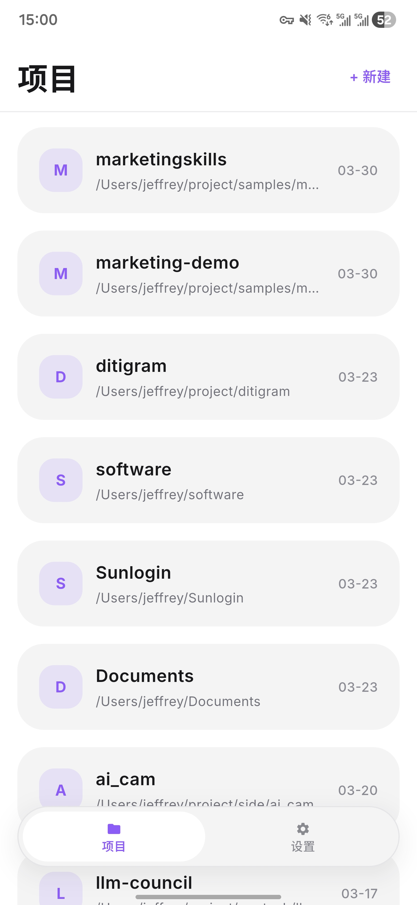
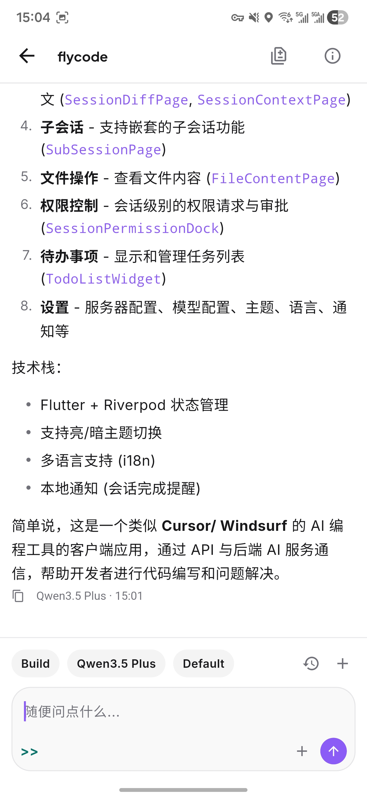
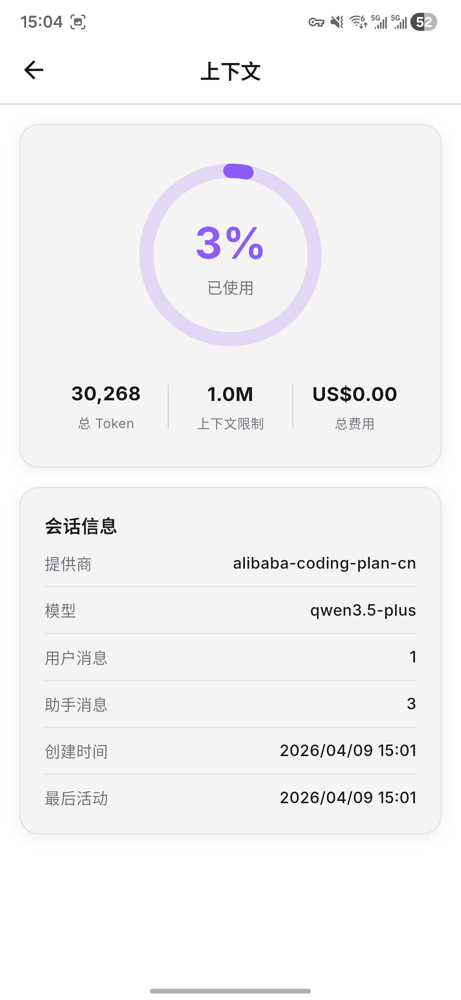

# FlyCode

[English](./README.md) | [简体中文](./README.zh-CN.md)

## 说明

FlyCode 是一个面向 Android 的 `opencode` 移动客户端。你可以通过它连接自己的 `opencode server`，浏览项目、继续已有会话，并在移动端和 coding agent 协作。

> 使用 FlyCode 前，需要先启动 `opencode server`。
> 文档：https://opencode.ai/docs/server/

<p align="center">
  
  
  
  
</p>

## Features

- 支持连接 `opencode server`，可自定义服务地址，并支持可选认证
- 支持浏览项目，并快速进入新建或已有的编码会话
- 提供适合移动端的 agent 对话体验
- 可在应用内查看权限请求、Todo、Diff 和会话上下文
- 支持调整模型、语言、主题模式和通知偏好
- **文件浏览器**：浏览项目目录树，点击查看文件内容
- **长按复制路径**：快速复制文件/目录的绝对路径

## 相较原版的增强

### 性能
- **最小粒度消息更新**：SSE 流式更新只刷新对应消息气泡，不重建整个列表
- **打字机动画降频**：24ms → 100ms，减少 75% 渲染开销
- **签名计算优化**：线性扫描代替全量 List 拷贝
- **预构建缓存**：`cacheExtent: 500` 平滑滚动

### 网络与缓存
- **30 条分页加载**：首次只拉最近 30 条，滑到顶部自动加载更多
- **sqflite 本地持久化**：消息缓存到手机存储，冷启动零网络出内容
- **HTTP 超时 60s**：大会话不再请求失败
- **内存保活**：`keepAlive()` 确保会话切换不重复拉取

### 新增功能
- **文件浏览器**：AppBar 📁 入口，浏览项目目录，查看文件内容
- **删除/重命名会话**：左滑删除，长按重命名
- **Todo 默认折叠**：不遮挡聊天视野

## Use

1. 在你的电脑上启动 `opencode server`。

```bash
opencode serve
```

2. 默认服务地址是 `http://127.0.0.1:4096`。
3. 在 Android 设备上安装 APK 并打开。
4. 应用会自动连接到默认地址，直接进入项目列表。
5. 选择项目，进入会话，开始和 agent 协作。
6. 如需修改服务地址，在设置 → 服务器中配置。

> 首次启动跳过连接配置页面，直接进入主界面。
> 默认服务器地址可在设置中修改。

服务端参考：

- 文档：https://opencode.ai/docs/server/
- 启动后的 OpenAPI 文档：`http://127.0.0.1:4096/doc`

## Build

如果你想自己构建 FlyCode，请先准备：

- Flutter SDK
- Dart SDK `^3.11.0`
- Android 构建环境
- 一个可用于本地联调的 `opencode server`

安装依赖：

```bash
flutter pub get
```

运行应用：

```bash
flutter run
```

指定设备运行：

```bash
flutter devices
flutter run -d <device-id>
```

如果你修改了需要生成代码的 model 或 provider，再执行：

```bash
dart run build_runner build
```

APK 构建：

```bash
flutter build apk --release
```
